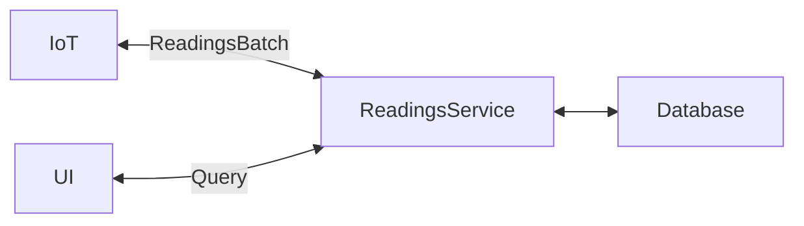
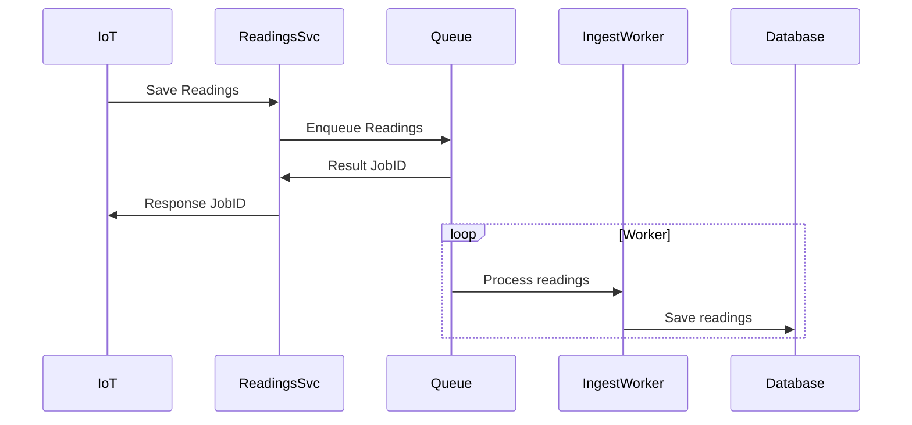
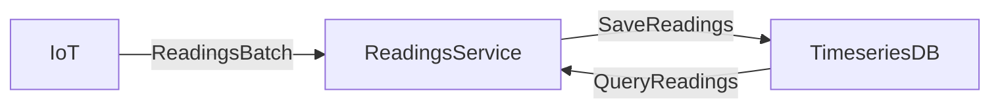

# Device Readings

Ingest data from devices and store it in a database.

## Requirements

### Functional Requirements

- Receive readings from IoT devices
- Readings should be queryable by device and time range
- Queries should support absolute and relative time ranges

### Non-Functional Requirements

- Handle burst traffic from devices (up to 1000 per second)
- Low latency for querying readings (aim for sub 500ms)
- Querying can tolerate eventual consistency with 5 minute delay

## System Interface

> **_Note_:** This could be /v1/devices/:id/readings or /v1/readings. I went with a top level endpoint to possibly support multiple devices in a batch.

POST /v1/readings (or /v1/devices/:id/readings)

```json
{
  "readings": [
    { "device_id": "device-1", "type":"temperature", "timestamp": "2021-01-01T00:00:00Z", "value": 25.0 }
  ]
}
```

GET /v1/readings?device_id=:deviceID&start=:start&end=:end

```json
{
    "readings": [
        {
            "device_id": "device-1",
            "type": "temperature",
            "timestamp": "2021-01-01T00:00:00Z",
            "value": 25.0,
        },
        {
            "device_id": "device-1",
            "type": "temperature",
            "timestamp": "2021-01-01T00:01:00Z",
            "value": 25.1,
        },
    ]
}
```

## Data Flow

- IoT device sends batched readings to Reading service
- Reading service reads, validates, deduplicates
- Reading service persists readings to database

## High Level Design



## Entities

Reading

- device_id
- type
- timestamp
- value

## Deep Dives (Choose 2)

- Use a queue to buffer incoming readings and handle bursts
- Use a time series database to store readings
- Durability - cannot lose information, ensure readings are archived
- RMDBS scaling
  - Utilize sharding for RMDBS to increase writes, read replicas for eventual query performance
  - Archive old readings to keep tables small
- Create a streaming data pipeline to ingest and store readings
  - Generate current readings
  - Generate rollups for archived readings
- Use a cache to store recent readings for fast query performance
- Calculate rollups if there are common query views (e.g. average temperature per hour)

### Queue

A queue allows ReadingsService to enqueue data and return a job ID to IoT device. This is significantly faster than performing real-time ingestion and storage.

Queues are also horizontally scalable at the producer and consumer stages. This allows bursty writes and also scaling up workers to meet queue backlog processing requirements.



### Timeseries database

TODO: verify this approach. I've used BigTable and Prometheus, but I am not sure about the durability of Prometheus.



[Timescaledb](https://www.timescale.com/) ~~Influx DB~~

Tradeoffs:

- Time series data native
- Not as flexible with evolving schema

Unknowns:

- Partition & Sharding (write performance, query performance)
- Replication (durability and read replica performance)

Table:

```sql
CREATE TABLE readings (
    timestamp TIMESTAMPTZ NOT NULL,
    device_id TEXT NOT NULL,
    reading_type TEXT NOT NULL,
    value DOUBLE PRECISION NOT NULL,
    PRIMARY KEY (timestamp, device_id, reading_type)
);

SELECT create_hypertable('readings', 'timestamp');

```

Write:

```go
type Reading struct {
  Timestamp   time.Time `gorm:"not null;index:idx_unique_reading,unique"                   json:"timestamp"`
  DeviceID    string    `gorm:"type:varchar(255);not null;index:idx_unique_reading,unique" json:"device_id"`
  ReadingType string    `gorm:"type:varchar(50);not null;index:idx_unique_reading,unique"  json:"reading_type"`
  Value       float64   `gorm:"not null"                                                   json:"value"`
}

db, err := gorm.Open(postgres.Open(dsn), &gorm.Config{}) // timescale is pg
db.Create(&Reading{
  Timestamp:   time.Now(),
  DeviceID:    "device-1",
  ReadingType: "temperature",
  Value:       25.0,
})
```

Read absolute time range:

```sql
SELECT value
FROM readings
WHERE device_id = 'device-1'
AND timestamp BETWEEN '2021-01-01T00:00:00Z' AND '2021-01-01T01:00:00Z';
```

Read relative time range:

```sql
SELECT value
FROM readings
WHERE device_id = 'device-1'
AND timestamp >= NOW() - INTERVAL '1 hour';
```
