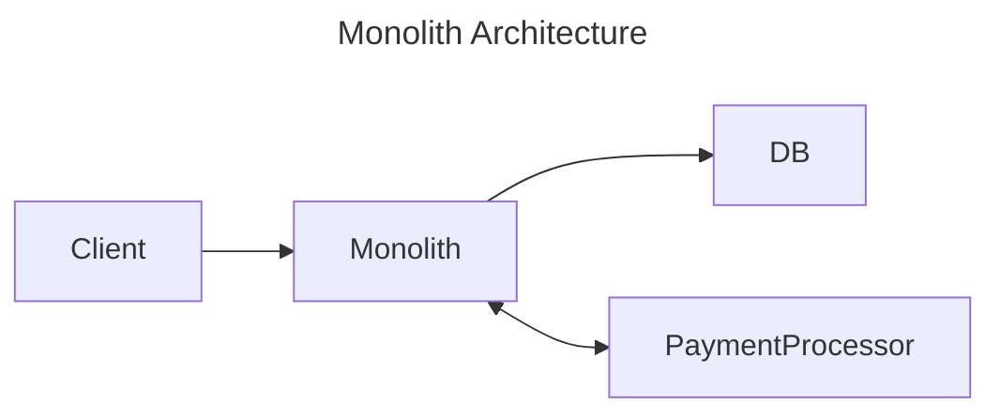
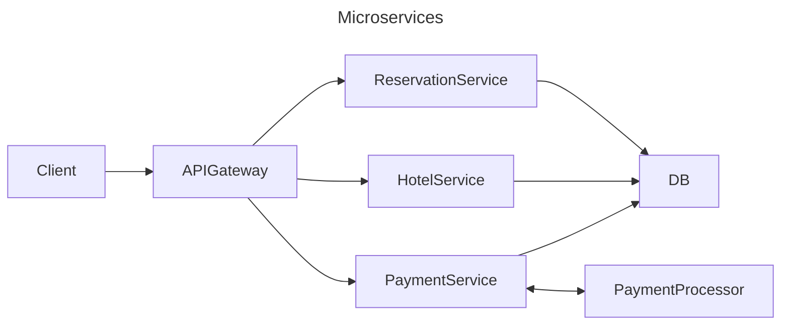
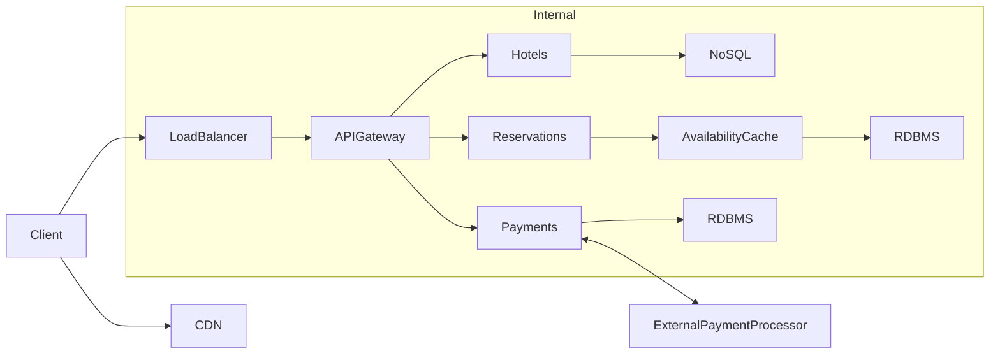

# Hotel Reservation System

The classic hotel reservation problem.

- [Architecture Evolution](#architecture-evolution)
  - [Phase 1: Monolith](#phase-1-monolith)
  - [Phase 2: Microservices Architecture](#phase-2-microservices-architecture)
  - [Phase 3: Distributed System](#phase-3-distributed-system)
- [Demo](#demo)

## Architecture Evolution

### Phase 1: Monolith



Problems:

- cannot scale individual pieces of the system
- query usage: view hotel > view room > create reservation
- full deployment required for updates
- managing state using sessions limits horizontal scaling

Possible Adjustments:

- DB read replicas (con: eventual consistency)
- Caching reads with Redis (cons: cache invalidation, stale data)
- CDN for static assets (cons: stale data, cost)
- Shard DB for write performance (con: complexity)

### Phase 2: Microservices Architecture



Benefits:

- can autoscale individual services based on load
- update services independently

Tradeoffs:

- everything is stateless
- services require inter-service communication
- microservice purity dictates each DB should be separate
- operational overhead
- requires deep observability

### Phase 3: Distributed System



- Hotel data should prioritize low latency and high availability; can be eventually consistent
- Reservations and Payments need strong consistency and ACID guarantees at the cost of latency; can shard for write performance
- Use CDC to invalidate cache when data changes
- NoSQL can also contain pre-computed materialized views from RDBMS
- CDN Edge caching
- Geo aware region/avaiability zones for low latency

## Demo

This project can be ran locally using tilt.dev.

Pre-requisites:

- Install [.tool-version](.tool-versions) using asdf-vm or preferred method

Launch the services:

```bash
tilt up
```

<!--
TODO: write up scenarios

## Create Reservation

scenario: user has found a hotel and wants to make a reservation

- guest finds a hotel with availability in the desired dates
- guest clicks "Book" which sends request to system (api gateway -> service)
- service creates Reservation with status=PENDING -> returns Reservation ID
- redirect client to payment
  - todo: release room availability if payment not completed within X minutes
- guest fills out form and submits payment
- request routed to payment service
  - note: do not store payment info, send directly to payment processor and store transaction ID
  - payment can be realtime OR webhook
  - payment processor uses HMAC webhook to notify system of payment success
  - update Reservation status to status=PAID
-->