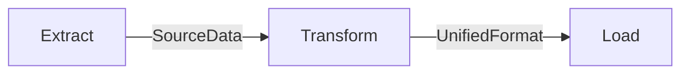

# Extract Transform Load (ETL) Data Pipeline

This is an example of how to build a generic data pipeline to ingest disparate data sources, transform into a unified format, and load into a target data store.

1. Pull data from source system
2. Transform source format to unified format
3. Store unified format in target system

## Tenets of ETL

- data is immutable
- transforms yield new data
- process is idempotent
- prefer passing data location over actual data
- ETL is implemented a Directed Acyclic Graph (DAG)
- all steps should be able to be replayed (example: fixing a bug in transform and being able to fix the data)

## Overview

Extract:

- should handle any source data format
- shouldn't pull the same data continuously (store or emit events)
- should tolerate new unknown fields
- use resilency patterns to be a good api consumer (backoff, retry, circuit breaker)
- handle resuming from a failure
- support full run (full data extraction) and incremental run (only new data since offset)

Transform:

- clear mapping from source to target
- transforms yield new data (never update existing)

Load:

- in this implementation, load calls the SaaS SDK to save assets into the system
- store high quality data for downstream consumers
- the destination can be anything but usually is either a data warehouse or a real-time DB

## Future Enhancements

- concurrency control (multiple data fetching, uploads)
- run type
  - incremental run since last known offset
  - full run for initial run or backfill reconciliation
