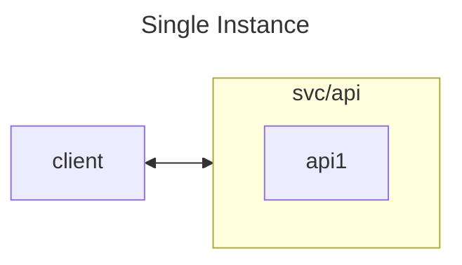
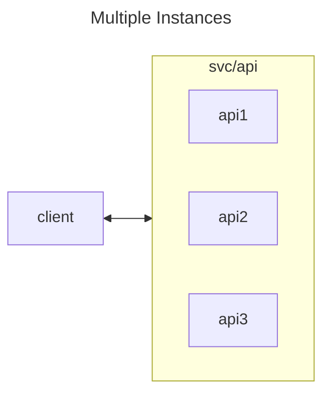
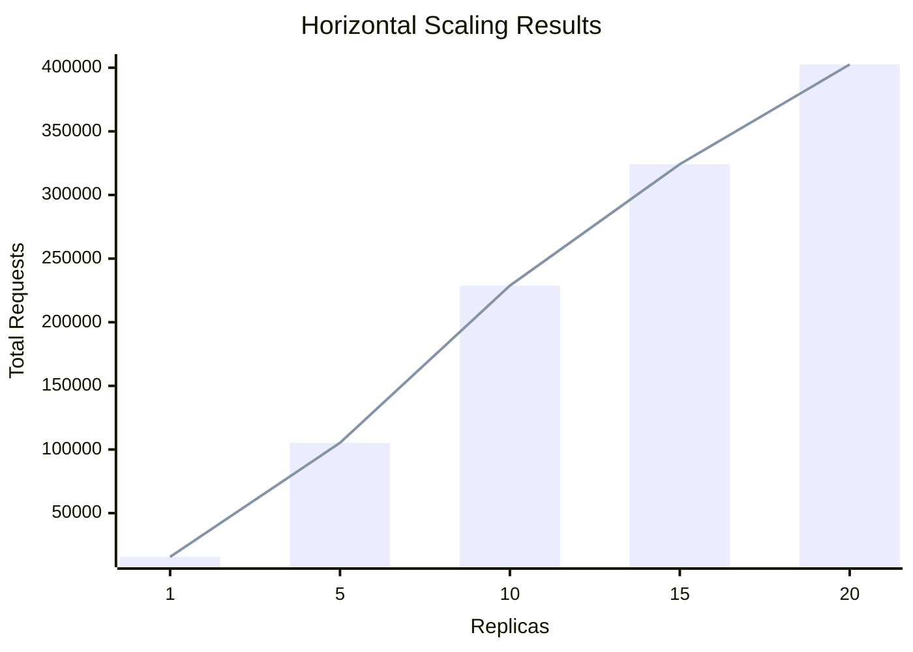

# Service Scaling Experiment

This experiments shows performance characteristics of a service when scaled horizontally and vertically.

## Scenarios

### Single Instance

- set values.yaml `replicaCount` set to 1
- run k6 job
- observe number of requests



### Horizontal Scaling - Multiple Instances

Scaled Scenario:

- set values.yaml `replicaCount` values.yaml to 2, 5, 10, etc.
- ensure pods are ready (`kubectl get pods` should show 5 pods)
- run k6 job
- observe number of requests



#### Results

Resource limits:

```yaml
resources:
  requests:
    cpu: "50m"
    memory: "64Mi"
  limits:
    cpu: "100m"
    memory: "128Mi"
```



### Vertical Scaling - Increase CPU Limits

TODO: add benchmarks

**NOTE**: The demo API doesn't perform cpu or memory intensive tasks, so horizontal scaling is more effective than vertical scaling.
