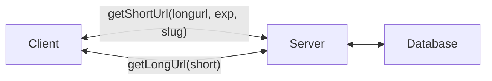

# url shortener

## Functional Requirements

- [ ] User can enter a URL and get a shortened URL
- [ ] User can enter a shortened URL and get redirected to the original URL
- [ ] Support expiry of shortened URLs
- [ ] User can see how many times a shortened URL has been used
- [ ] Allow custom short URLs

## Non-Functional Requirements

- Short urls must always be unique (strong consistency on write)
- Reads can be eventually consistent
- Anticipate more reads than writes

## Core Entities

- Short URL
- User

## APIs

- POST /urls
  - Request: url, expiry, slug
  - Response: Short URL

- GET /:slug <- top level route, keep as short as possible
  - Response: 302 redirect to original URL

- GET /urls/:slug/stats
  - Response: Usage

## High Level Design

### Entities

Short URL:

- id
- longUrl
- slug
- expiresAt
- user_id

URL Stats

- url_id
- view_count

User

- id

## Deep Dives

TODO
