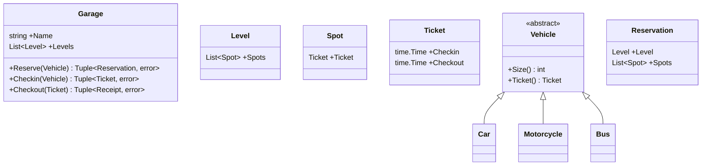
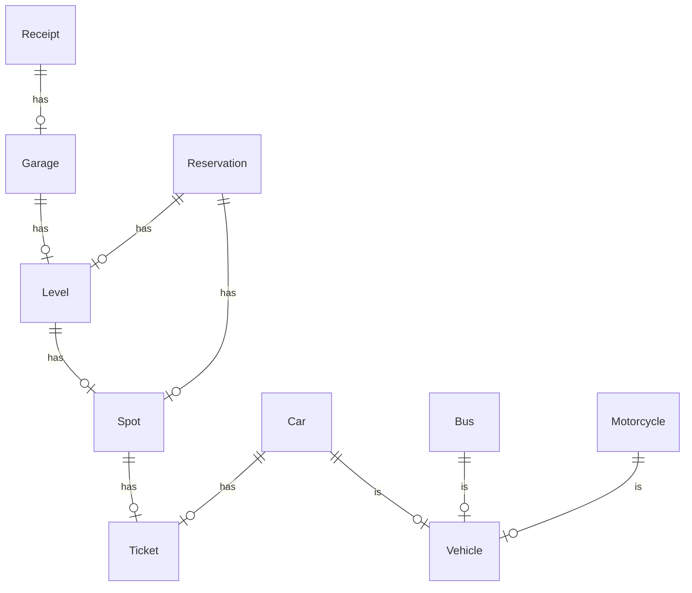
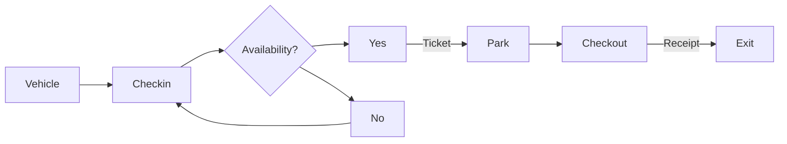

# Design a Parking Garage

Low level design for a parking garage.

## Requirements

- Parking lot has multiple levels
- Each level has spots
- Parking lot can park motorcycles, cars, and buses
- A motorcycle can park in any spot
- A car can park in a single spot
- A bus can park in five contiguous spots

## Class Diagram

## Entity Relationships

## Workflow

## Out of Scope

- Gates
- Vehicle methods: Park, Drive, etc
- Custom Rates (Garage, vehicle type, etc.)
- Payment
  - PaymentGateway
  - Types: CC, Parking Pass
- Reporting
  - Currently available
  - Currently reserved
  - Breakdowns by vehicle type
  - Sales
  - Availability over time
